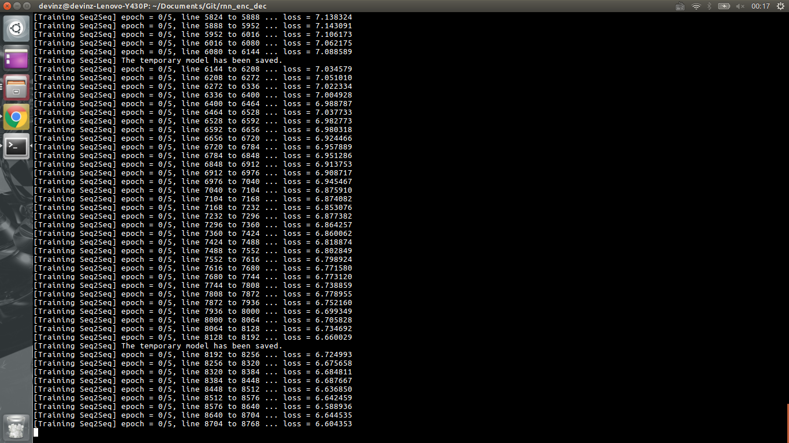

# RNN-based Poem Generator

A classical Chinese quatrain generator based on the RNN encoder-decoder framework.

Two 4-layer LSTM networks are used as encoder and decoder respectively.
The encoder takes as input four keywords provided by a poem planner,
and the decoder generates a quatrain character by character. [1]

The original repository is [here](https://github.com/DevinZ1993/Chinese-Poetry-Generation), 
where there are also a bunch of raw data files necessary to train the model.
The raw data files were downloaded from the Internet, mostly from similar open source projects.

    raw/
    ├── ming.all
    ├── pinyin.txt
    ├── qing.all
    ├── qsc_tab.txt
    ├── qss_tab.txt
    ├── qtais_tab.txt
    ├── qts_tab.txt
    ├── shixuehanying.txt
    ├── stopwords.txt
    └── yuan.all

## Dependencies

Python 3.7

[TensorFlow 1.10](https://www.tensorflow.org/)

[Jieba 0.38](https://github.com/fxsjy/jieba)

[Gensim 2.0.0](https://radimrehurek.com/gensim/)

## Training

To begin with, you should process the raw data to generate the training data:

    python data_utils.py

The TextRank algorithm may take many hours to run.
Instead, you could choose to stop it early by typing ctrl+c to interrupt the iterations,
when the progress shown in the terminal has remained stationary for a long time.

Then, generate the word embedding data using gensim Word2Vec model:

    python word2vec.py

Now, type the following command and wait for several hours:

    python train.py

## Run Tests

Start the user interaction program in a terminal once the training has finished:

    python main.py

Type in an input sentence each time and the poem generator will create a poem for you.

## Note
[1] The planning-based poem generation workflow is adopted from 
[Zhe Wang et al. <i>Chinese Poetry Generation with Planning based Neural Network</i>. 2016](https://arxiv.org/abs/1610.09889),
yet I made two simplifications here.

Firstly, instead of using the attention-based RNN enc-dec model that the paper put forward,
I simply employed the plain-vanilla seq2seq model in generate.py.

Secondly, I used the word2vec model for poem planning in plan.py instead of training an RNN language model
as the paper specified.

Future efforts can be made in those two scripts in order to improve the performance of poem planning or generation.
